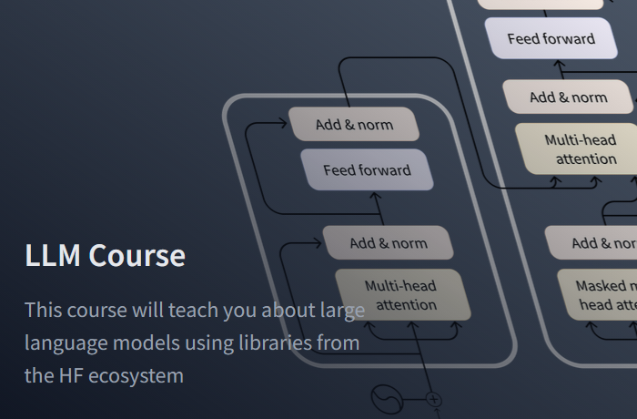

  
  <h1>Hugging Face LLM Course</h1>
  
  

    Course provided by Hugging Face on LLMs. It teaches about large language models using libraries from the HF ecosystem
  

 

<!-- Badges -->

## Tools

---

 

<!-- Table of Contents -->

# :notebook_with_decorative_cover: Table of Contents

- [About the Project](#star2-about-the-project)
- [Data](#handshake-contact)
- [Contact](#handshake-contact)
- [Acknowledgements](#gem-acknowledgements)

<!-- About the Project -->

## :star2: About the Project

This course will teach you about large language models (LLMs) and natural language processing (NLP) using libraries from the Hugging Face ecosystem — 🤗 Transformers, 🤗 Datasets, 🤗 Tokenizers, and 🤗 Accelerate — as well as the Hugging Face Hub

## :floppy_disk: Data

No content yet

## :handshake: Contact

Author: Martin Ho

Project Link: [Github](https://github.com/minimartzz/learning)

<!-- Acknowledgments -->

## :gem: Acknowledgements

- [Course Source](https://huggingface.co/learn/llm-course/en/chapter1/1)
